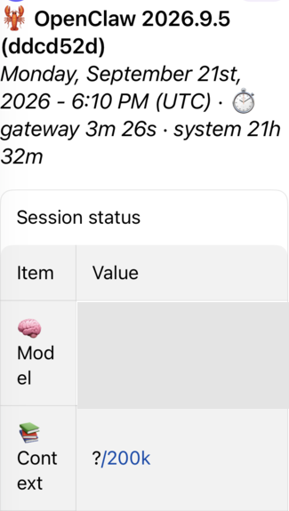

# Telegram status table: manual current-main proof

Candidate source commit: `8ef735cf997354767e03e3c15b074cd1026c5378` (tested files unchanged from the qualified working tree).
Base: `ddcd52d5bffdf570aeb76c3d422236702f99415f`.

Real Telegram iOS client, real Telegram bot, disposable built runtime. Rich messages enabled; streaming mode partial. Fresh native `/status` command displayed the native Session status table. Human observer confirmed exactly one reply. No model turn was exercised. Temporary runtime removed after capture.

Screenshot is resized/cropped; model value is covered with an opaque rectangle. Chat identity and private session rows are omitted. The version label names the base because the same tested patch was uncommitted when built; SHA-256 equality was verified for the three changed production files before the live command. Single-reply evidence is human confirmation, not a wire-level trace. This is manual proof, not the upstream Test Server userbot lane.

Local validation: four regression cases failed before the fix; candidate passed 200 tests across seven Telegram suites, formatting, full extension production and test typechecks, and independent source review. Lint had zero errors and one file-length warning. Full repository CI is separate.
